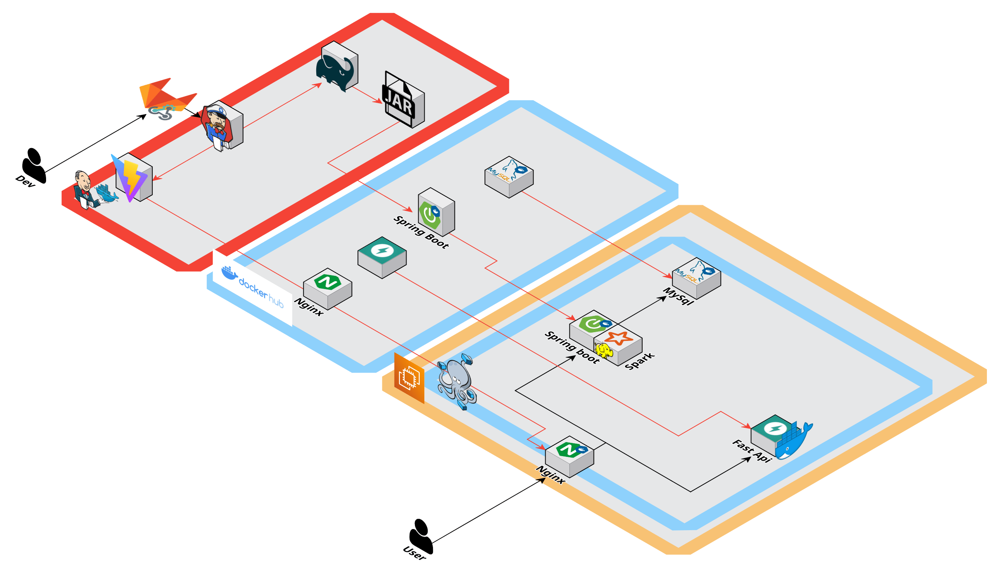
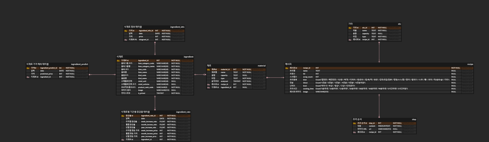

#  미정(味定)

> 백치미 (구미 1반 7조 D107)
>
> 미정(味定)
>
> 프로젝트 기간 : 2024.08.19~ 2024.10.11 (8주)

  <a href="https://www.notion.so/tassel/D107-107-34da1704badc460b8bcb6942605d4b08?pvs=4">노션</a>
    |    
  <a href="https://www.figma.com/design/AadeSeq0rUmGmh0HFIoyka/Untitled?node-id=0-1&t=5W5GnKDlhCzaIu3j-0">피그마</a>

## 👇 미정(味定) 소개 및 시연 영상 👇

[](https://file.notion.so/f/f/5dd88902-74d6-4473-8ddd-8fa9e78b1bf1/898cb0bf-1c5f-48a3-a72a-ae66be4501e2/11%EA%B8%B0_%ED%8A%B9%ED%99%94PJT_%EC%98%81%EC%83%81_%ED%8F%AC%ED%8A%B8%ED%8F%B4%EB%A6%AC%EC%98%A4_D107.mp4?table=block&id=597f7aa3-3ed9-4b81-9861-d875a9b4d904&spaceId=5dd88902-74d6-4473-8ddd-8fa9e78b1bf1&expirationTimestamp=1728777600000&signature=YRHa67cK7ctJQAse1CrtEQfYFXvnDy09CFRaROFS_zQ&downloadName=11%EA%B8%B0_%ED%8A%B9%ED%99%94PJT_%EC%98%81%EC%83%81_%ED%8F%AC%ED%8A%B8%ED%8F%B4%EB%A6%AC%EC%98%A4_D107.mp4)

미정(味定) 시나리오는 👉[여기](https://www.notion.so/tassel/b615636bcacb4165a24c6d3ba2e9e7fa?pvs=4)👈에서 더 자세히 보실 수 있습니다.

 
 

# :rice_ball: 미정(味定) 서비스 설명

### 📌 개요

**사용자가 현재 식재료 가격 변동을 확인하고, 연관된 식재료와 레시피를 추천받아 합리적이고 맛있는 요리를 준비할 수 있도록 도와주는 통합 플랫폼입니다.
분산처리를 활용하여 대용량 데이터를 효율적으로 분석하고,
사용자에게 맞춤형 추천을 제공합니다.**

### 💡 미정(味定) 목적

- 물가 변동을 확인하여 저렴한 식재료를 한눈에 확인할 수 있습니다.
- 사용자가 원하는 식재료에 맞는 레시피를 추천 받을 수 있습니다.
- 사용자가 원하는 식재료와 많이 쓰이는 식재료를 추천 받을 수 있습니다.

### <u>🍀 사용자에게 식재료 시세와 레시피 제공</u>

**🙋🏻‍♂️ 사용자 목표**

> 요리를 좋아하는 사람들이 온라인으로 식재료에 가격 정보와 레시피에 대한 정보를 얻을 수 있는 플랫폼

## 🖥️ 미정(味定) 서비스 화면

### 랜딩 페이지

https://private-user-images.githubusercontent.com/101388919/393615606-92d62a1a-857a-49a3-861c-098f28258daf.mp4?jwt=eyJhbGciOiJIUzI1NiIsInR5cCI6IkpXVCJ9.eyJpc3MiOiJnaXRodWIuY29tIiwiYXVkIjoicmF3LmdpdGh1YnVzZXJjb250ZW50LmNvbSIsImtleSI6ImtleTUiLCJleHAiOjE3MzM2NzEzNTEsIm5iZiI6MTczMzY3MTA1MSwicGF0aCI6Ii8xMDEzODg5MTkvMzkzNjE1NjA2LTkyZDYyYTFhLTg1N2EtNDlhMy04NjFjLTA5OGYyODI1OGRhZi5tcDQ_WC1BbXotQWxnb3JpdGhtPUFXUzQtSE1BQy1TSEEyNTYmWC1BbXotQ3JlZGVudGlhbD1BS0lBVkNPRFlMU0E1M1BRSzRaQSUyRjIwMjQxMjA4JTJGdXMtZWFzdC0xJTJGczMlMkZhd3M0X3JlcXVlc3QmWC1BbXotRGF0ZT0yMDI0MTIwOFQxNTE3MzFaJlgtQW16LUV4cGlyZXM9MzAwJlgtQW16LVNpZ25hdHVyZT0zZGZjZWRkNTQ4ZjkwYTJhZmQ5NTIxYTJmN2EwOWZlYjI0NTdhNmEwMmY4MzBlNzc1ZjUyZTI3MDc4ZjY0YWNmJlgtQW16LVNpZ25lZEhlYWRlcnM9aG9zdCJ9.K4JaOhsfwEJownntlwb01s-N_WmjiQTS6n8fBJcu_i0

### 메인화면 - 식재료 가격

### 식재료 - 목록, 검색

https://private-user-images.githubusercontent.com/101388919/393615888-4c5c6c3c-dc01-424b-b25c-79af8a9468a4.mp4?jwt=eyJhbGciOiJIUzI1NiIsInR5cCI6IkpXVCJ9.eyJpc3MiOiJnaXRodWIuY29tIiwiYXVkIjoicmF3LmdpdGh1YnVzZXJjb250ZW50LmNvbSIsImtleSI6ImtleTUiLCJleHAiOjE3MzM2NzEzNTEsIm5iZiI6MTczMzY3MTA1MSwicGF0aCI6Ii8xMDEzODg5MTkvMzkzNjE1ODg4LTRjNWM2YzNjLWRjMDEtNDI0Yi1iMjVjLTc5YWY4YTk0NjhhNC5tcDQ_WC1BbXotQWxnb3JpdGhtPUFXUzQtSE1BQy1TSEEyNTYmWC1BbXotQ3JlZGVudGlhbD1BS0lBVkNPRFlMU0E1M1BRSzRaQSUyRjIwMjQxMjA4JTJGdXMtZWFzdC0xJTJGczMlMkZhd3M0X3JlcXVlc3QmWC1BbXotRGF0ZT0yMDI0MTIwOFQxNTE3MzFaJlgtQW16LUV4cGlyZXM9MzAwJlgtQW16LVNpZ25hdHVyZT0yOTM2OGQ1NTI0OTU2OWU5NDU2MmQxMDNmZTgxMWQyNTM4Y2FiMjg2ZDhiMGFlYzI2NjA5YmE1NTY3YmFiMTc2JlgtQW16LVNpZ25lZEhlYWRlcnM9aG9zdCJ9.DWzlO4jKqGjkQNswLkzQaj1rKnNvNpaTHaN1KedNM6Q

### 식재료 상세보기 - 식재료 정보, 식재료 가격추이 그래프, 네트워크 그래프, 레시피 추천

https://private-user-images.githubusercontent.com/101388919/393615832-e527a93f-727f-40ce-93de-ff5276aad57b.mp4?jwt=eyJhbGciOiJIUzI1NiIsInR5cCI6IkpXVCJ9.eyJpc3MiOiJnaXRodWIuY29tIiwiYXVkIjoicmF3LmdpdGh1YnVzZXJjb250ZW50LmNvbSIsImtleSI6ImtleTUiLCJleHAiOjE3MzM2NzEzNTEsIm5iZiI6MTczMzY3MTA1MSwicGF0aCI6Ii8xMDEzODg5MTkvMzkzNjE1ODMyLWU1MjdhOTNmLTcyN2YtNDBjZS05M2RlLWZmNTI3NmFhZDU3Yi5tcDQ_WC1BbXotQWxnb3JpdGhtPUFXUzQtSE1BQy1TSEEyNTYmWC1BbXotQ3JlZGVudGlhbD1BS0lBVkNPRFlMU0E1M1BRSzRaQSUyRjIwMjQxMjA4JTJGdXMtZWFzdC0xJTJGczMlMkZhd3M0X3JlcXVlc3QmWC1BbXotRGF0ZT0yMDI0MTIwOFQxNTE3MzFaJlgtQW16LUV4cGlyZXM9MzAwJlgtQW16LVNpZ25hdHVyZT02Mjk0OTFhM2QxMDk4MmViNGIxMDQ1MjFkNTAzYzFjNDgwM2ZmOWFkYmVlNjBlMzhlNDhmMmE3OGJhMTgwMjA0JlgtQW16LVNpZ25lZEhlYWRlcnM9aG9zdCJ9.N76E6uA-rS4nf2Vt3zRizk7dNpBYrff85LJqfZMpdgo

https://private-user-images.githubusercontent.com/101388919/393615820-e72884a1-6d8b-4aca-aaf0-9603a748af17.mp4?jwt=eyJhbGciOiJIUzI1NiIsInR5cCI6IkpXVCJ9.eyJpc3MiOiJnaXRodWIuY29tIiwiYXVkIjoicmF3LmdpdGh1YnVzZXJjb250ZW50LmNvbSIsImtleSI6ImtleTUiLCJleHAiOjE3MzM2NzEzNTEsIm5iZiI6MTczMzY3MTA1MSwicGF0aCI6Ii8xMDEzODg5MTkvMzkzNjE1ODIwLWU3Mjg4NGExLTZkOGItNGFjYS1hYWYwLTk2MDNhNzQ4YWYxNy5tcDQ_WC1BbXotQWxnb3JpdGhtPUFXUzQtSE1BQy1TSEEyNTYmWC1BbXotQ3JlZGVudGlhbD1BS0lBVkNPRFlMU0E1M1BRSzRaQSUyRjIwMjQxMjA4JTJGdXMtZWFzdC0xJTJGczMlMkZhd3M0X3JlcXVlc3QmWC1BbXotRGF0ZT0yMDI0MTIwOFQxNTE3MzFaJlgtQW16LUV4cGlyZXM9MzAwJlgtQW16LVNpZ25hdHVyZT1iZGYwYjhlMDYyZDJhNjg5MDk0YTUwZTJkNGIzN2YxN2Y4ODdmOGJjNjFmNDI2NjY1OTRjNzIyZTJkMmQyNTk2JlgtQW16LVNpZ25lZEhlYWRlcnM9aG9zdCJ9.xOogcyZDGejW_RFZf5VxiasTd8z8Z54MlPVxeBYXinY

https://private-user-images.githubusercontent.com/101388919/393615990-9c1033db-9d7b-4c65-a12a-13e368297b8f.mp4?jwt=eyJhbGciOiJIUzI1NiIsInR5cCI6IkpXVCJ9.eyJpc3MiOiJnaXRodWIuY29tIiwiYXVkIjoicmF3LmdpdGh1YnVzZXJjb250ZW50LmNvbSIsImtleSI6ImtleTUiLCJleHAiOjE3MzM2NzEzNTEsIm5iZiI6MTczMzY3MTA1MSwicGF0aCI6Ii8xMDEzODg5MTkvMzkzNjE1OTkwLTljMTAzM2RiLTlkN2ItNGM2NS1hMTJhLTEzZTM2ODI5N2I4Zi5tcDQ_WC1BbXotQWxnb3JpdGhtPUFXUzQtSE1BQy1TSEEyNTYmWC1BbXotQ3JlZGVudGlhbD1BS0lBVkNPRFlMU0E1M1BRSzRaQSUyRjIwMjQxMjA4JTJGdXMtZWFzdC0xJTJGczMlMkZhd3M0X3JlcXVlc3QmWC1BbXotRGF0ZT0yMDI0MTIwOFQxNTE3MzFaJlgtQW16LUV4cGlyZXM9MzAwJlgtQW16LVNpZ25hdHVyZT04MmU0ZjczMWU0NDc0N2E3M2I3MTQzNjJiNjNlNTlmZmJiMWM3MjJlNTZjYmQxYmZhMzQ3OTliNDIyMzNkN2U3JlgtQW16LVNpZ25lZEhlYWRlcnM9aG9zdCJ9.XmMggDY7N41-FewkXRa_6Dyk8II2aXDBBqz1hBQmoQU

### 레시피 - 목록, 검색

https://private-user-images.githubusercontent.com/101388919/393615939-498a789a-07ba-4ea3-8901-b72e9ad32b7b.mp4?jwt=eyJhbGciOiJIUzI1NiIsInR5cCI6IkpXVCJ9.eyJpc3MiOiJnaXRodWIuY29tIiwiYXVkIjoicmF3LmdpdGh1YnVzZXJjb250ZW50LmNvbSIsImtleSI6ImtleTUiLCJleHAiOjE3MzM2NzEzNTEsIm5iZiI6MTczMzY3MTA1MSwicGF0aCI6Ii8xMDEzODg5MTkvMzkzNjE1OTM5LTQ5OGE3ODlhLTA3YmEtNGVhMy04OTAxLWI3MmU5YWQzMmI3Yi5tcDQ_WC1BbXotQWxnb3JpdGhtPUFXUzQtSE1BQy1TSEEyNTYmWC1BbXotQ3JlZGVudGlhbD1BS0lBVkNPRFlMU0E1M1BRSzRaQSUyRjIwMjQxMjA4JTJGdXMtZWFzdC0xJTJGczMlMkZhd3M0X3JlcXVlc3QmWC1BbXotRGF0ZT0yMDI0MTIwOFQxNTE3MzFaJlgtQW16LUV4cGlyZXM9MzAwJlgtQW16LVNpZ25hdHVyZT00YmU3OTIyMDljMTAzYzA2M2VmZjM4MTA3YmVmMTQ1YTgwMDg5MTY2M2YyNjYwNzA0Y2EwYjk2NmI2YTA1MWMxJlgtQW16LVNpZ25lZEhlYWRlcnM9aG9zdCJ9.ThXdLwv--PgJHMerAj1ZLyWamZX8K6avMkHKnlcx0MA

https://private-user-images.githubusercontent.com/101388919/393615965-f66cffee-8cf3-4c71-8015-ad209b412773.mp4?jwt=eyJhbGciOiJIUzI1NiIsInR5cCI6IkpXVCJ9.eyJpc3MiOiJnaXRodWIuY29tIiwiYXVkIjoicmF3LmdpdGh1YnVzZXJjb250ZW50LmNvbSIsImtleSI6ImtleTUiLCJleHAiOjE3MzM2NzEzNTEsIm5iZiI6MTczMzY3MTA1MSwicGF0aCI6Ii8xMDEzODg5MTkvMzkzNjE1OTY1LWY2NmNmZmVlLThjZjMtNGM3MS04MDE1LWFkMjA5YjQxMjc3My5tcDQ_WC1BbXotQWxnb3JpdGhtPUFXUzQtSE1BQy1TSEEyNTYmWC1BbXotQ3JlZGVudGlhbD1BS0lBVkNPRFlMU0E1M1BRSzRaQSUyRjIwMjQxMjA4JTJGdXMtZWFzdC0xJTJGczMlMkZhd3M0X3JlcXVlc3QmWC1BbXotRGF0ZT0yMDI0MTIwOFQxNTE3MzFaJlgtQW16LUV4cGlyZXM9MzAwJlgtQW16LVNpZ25hdHVyZT04NTRmMTMyOTJhMDFhM2JmYjE1ODM3NWU1MGUwMGI3OTBlOGFkNWJmM2M3NGJhMDVkZTRhZmUzYTJiYjYxNTk1JlgtQW16LVNpZ25lZEhlYWRlcnM9aG9zdCJ9.menDoq3AO3zCiUG5JHKeUqMGS8872wKnISE2_USx4ds

### 레시피 상세보기 - 레시피 재료, 조리 방법, QR코드

### 나만의 요리 도우미 - 식재료 추가, 삭제, 검색

### 나만의 요리 도우미 - 식재료 추천

https://private-user-images.githubusercontent.com/101388919/393615851-aa35ae9a-ce77-492b-88f1-b22059f96592.mp4?jwt=eyJhbGciOiJIUzI1NiIsInR5cCI6IkpXVCJ9.eyJpc3MiOiJnaXRodWIuY29tIiwiYXVkIjoicmF3LmdpdGh1YnVzZXJjb250ZW50LmNvbSIsImtleSI6ImtleTUiLCJleHAiOjE3MzM2NzEzNTEsIm5iZiI6MTczMzY3MTA1MSwicGF0aCI6Ii8xMDEzODg5MTkvMzkzNjE1ODUxLWFhMzVhZTlhLWNlNzctNDkyYi04OGYxLWIyMjA1OWY5NjU5Mi5tcDQ_WC1BbXotQWxnb3JpdGhtPUFXUzQtSE1BQy1TSEEyNTYmWC1BbXotQ3JlZGVudGlhbD1BS0lBVkNPRFlMU0E1M1BRSzRaQSUyRjIwMjQxMjA4JTJGdXMtZWFzdC0xJTJGczMlMkZhd3M0X3JlcXVlc3QmWC1BbXotRGF0ZT0yMDI0MTIwOFQxNTE3MzFaJlgtQW16LUV4cGlyZXM9MzAwJlgtQW16LVNpZ25hdHVyZT04ODhhYjQyM2EzMDI1ZjMyOWQxNTBlOTljOTZhNTA3YzhhMWYxODkzNzYzNmQwYTk4NjhkNzBhZThkYTY1OGI4JlgtQW16LVNpZ25lZEhlYWRlcnM9aG9zdCJ9.xoOeofjxIDGbxzMs_q2zm39MAKEd5z_HQzfQc0x-mLs

### 나만의 요리 도우미 - 추천 레시피

https://private-user-images.githubusercontent.com/101388919/393616653-f6f4c215-e177-4423-be13-529c318a415e.mp4?jwt=eyJhbGciOiJIUzI1NiIsInR5cCI6IkpXVCJ9.eyJpc3MiOiJnaXRodWIuY29tIiwiYXVkIjoicmF3LmdpdGh1YnVzZXJjb250ZW50LmNvbSIsImtleSI6ImtleTUiLCJleHAiOjE3MzM2NzEzNTEsIm5iZiI6MTczMzY3MTA1MSwicGF0aCI6Ii8xMDEzODg5MTkvMzkzNjE2NjUzLWY2ZjRjMjE1LWUxNzctNDQyMy1iZTEzLTUyOWMzMThhNDE1ZS5tcDQ_WC1BbXotQWxnb3JpdGhtPUFXUzQtSE1BQy1TSEEyNTYmWC1BbXotQ3JlZGVudGlhbD1BS0lBVkNPRFlMU0E1M1BRSzRaQSUyRjIwMjQxMjA4JTJGdXMtZWFzdC0xJTJGczMlMkZhd3M0X3JlcXVlc3QmWC1BbXotRGF0ZT0yMDI0MTIwOFQxNTE3MzFaJlgtQW16LUV4cGlyZXM9MzAwJlgtQW16LVNpZ25hdHVyZT1kMDhkN2E2N2Y2NjY5MzJhN2YxMGJkZDIwZTMyZmQ5YjY4NjI4Y2QxMGU4ZmYxMTA5NmNmYjhhNmIyNjA2NDE1JlgtQW16LVNpZ25lZEhlYWRlcnM9aG9zdCJ9.wcJ1d5_XZo-rvwBfmKEheB7ZBik6rvh3pyQwUNAsX-s

### 찜한 레시피

 
 

## 🔎 주요 기능

- 식재료 가격 제공
- 식재료 목록 검색
  - 검색어 자동완성
- 식재료 가격 추이 그래프
  - 시계열 분석
- 식재료 네트워크 그래프
  - 코사인 유사도
- 레시피 목록 검색
  - 검색어 자동완성
- 선택한 식재료 기반 식재료/레시피 추천
  - 식재료 추천 : 연관성 분석(장바구니 분석)
  - 레시피 추천 : 코사인 유사도

### 기술 관점

- CI/CD 파이프라인 구축 및 배포 자동화
- FrntEnd, BackEnd, DB를 각 docker 컨테이너로 관리하여 빌드 및 배포를 통해 안정적인 CI / CD 구축
- 임베딩과 코사인 유사도

  - 단어 임베딩과 방법론 : 단어를 컴퓨터로 계산하기 위해서는 이를 계산 가능한 실수로 표현해야 합니다. 즉, 단어를 공간에 매핑하는 것으로 이는 '임베딩'이라고 합니다. 임베딩에는 두 가지 주요 방법론이 있습니다: CBOW(Continuous Bag of Words)와 Skip-gram입니다.
  - CBOW 방법론 : CBOW는 특정 단어의 주변 단어들을 활용해 그 단어를 예측하는 방법입니다. 예를 들어, "the quick brown fox"라는 문장에서는 "quick"이라는 단어를 예측하기 위해 "the", "brown", "fox"라는 단어들을 입력으로 사용합니다. 이를 통해 "quick"을 공간 상에 잘 매핑합니다.
  - Skip-gram 방법론 : Skip-gram은 반대로, "quick"이라는 단어를 사용해 "the", "brown", "fox"를 예측할 수 있도록 "quick"을 공간에 매핑하도록 하는 방법입니다. 일반적으로 Skip-gram 방법론이 많이 사용되지만, 본 프로젝트에서는 여러 재료 중 하나를 예측하는 가정에 따라 CBOW 방법론을 활용해 임베딩을 진행했습니다,
  - 코사인 유사도 : 코사인 유사도는 두 벡터가 이루는 각도를 통해 벡터가 얼마나 유사한지를 측정합니다. 유사도가 1에 가까울수록 두 벡터가 유사하다고 정의합니다.

- 장바구니 분석 : 장바구니 연관 규칙 기반 추천 시스템을 사용하여 레시피에 사용된 식재료와 관련된 패턴을 분석하여, 사용자가 선택한 식재료와 레시피에서 많이 사용된 식재료를 추천합니다. Apache Spark의 FPGrowth 알고리즘을 활용하여 대규모 데이터를 빠르게 분석합니다.
- 시계열 분석 :

- 사용자 맞춤형 시각화 도구 : 네트워크 그래프, 시세 차트 등 다양한 시각화 도구를 사용하여 데이터를 직관적으로 표현하고, 사용자 경험을 개선합니다.

### 기능 관점

- 가격 변동 분석 : 사용자가 식재료에 대한 가격 추이를 확인하고, 예측하여 식재료에 대한 정보를 확인할 수 있습니다.
- 맞춤형 추천 기능: 사용자의 식재료 선택에 따라 적합한 레시피와 식재료를 추천하여, 요리 준비 과정을 단순화합니다.
- 종합적인 식재료 정보 제공: 가격 변동 분석, 네트워크 그래프 등을 통해 사용자가 필요한 모든 정보를 종합적으로 제공합니다.

## 🔨 개발 환경

🛠️**Backend**

- IntelliJ
- Spring boot
- Spring-boot-jpa
- Java 17
- MySQL
- Visual Studio Code
- Hadoop/Spark
- Gradle
- Python
- FastAPI

🛠️**Frontend**

- Visual Studio Code
- React
- Tanstack React Query
- Tailwind
- Zustand
- TypeScript
- D3.js
- Sigma.js
- vis.js

🛠️**CI/CD**

- AWS EC2
- Docker
- Nginx
- Jenkins

## 🔨 기술 스택

### 1. 🛠️ 아키텍처 설계

- 프론트엔드
  - React.js : UI/UX 설계
  - Zustand : 상태 관리
  - Chart.js/D3.js : 데이터 시각화
- 백엔드
  - Java + Spring Boot : API 서버 구축
  - Python : 데이터 수집, 분석, 크롤링 로직 구현
- 데이터베이스
  - MySQL : 식재료 및 레시피 데이터 관리
- 분산 처리 및 데이터 분석

  - Hadoop을 사용해 대규모 데이터를 분산 처리
  - Apache Spark를 활용한 데이터 분석

  ### 2. ☁️ 클라우드 인프라 및 배포

- 클라우드 인프라
  - AWS EC2 : 웹 서버와 데이터베이스 서버 호스팅
- CI/CD
  - Jenkins 또는 Gitlab webhook으로 지속적 통합/배포(CI/CD) 파이프라인 구축
  - 모니터링 및 로깅 : AWS CloudWatch로 서버 및 애플리케이션 모니터링

## 📚 파이썬 라이브러리 요약

- pandas: 데이터 처리
- numpy: 벡터 연산
- mlxtend: 카테고리별 연관 규칙 학습
- collections: 빈도 분석
- scikit-learn: 코사인 유사도 계산
- APScheduler: 작업 스케쥴러
- fastapi: 서버
- PyMySQL: DB
- pytest: 테스트
## 📋 미정(味定) 관련 문서

### 기능 명세서

[기능 명세서](https://www.notion.so/tassel/f4b8056bdf5e4fab9a5a521341a856da?v=33da9e4d6856433fa6922334f2959398&pvs=4)

### 와이어프레임

[와이어프레임](https://www.figma.com/design/AadeSeq0rUmGmh0HFIoyka/%ED%8A%B9%ED%99%94%ED%94%84%EB%A1%9C%EC%A0%9D%ED%8A%B8-D107?node-id=256-10212&node-type=canvas&t=9nuWWIxDkumX1MGj-0)

### 서비스 아키텍처

### ERDiagram

### API 명세서

[API 명세서](https://www.notion.so/tassel/API-9519692f60bc4b149bfb2f3f8949a360?pvs=4)

## 👩‍💻👨‍💻 Member

|                 정지원                 |                  김소연                  |                 박태우                 |
| :------------------------------------: | :--------------------------------------: | :------------------------------------: |
|             **팀장 / BE**              |                  **BE**                  |                 **BE**                 |
| [@Jiwon96](https://github.com/Jiwon96) | [@so-oyeon](https://github.com/so-oyeon) | [twey163@gmail.com](twey163@gmail.com) |

|                     권대호                     |                     김봉상                     |                            신건우                            |
| :--------------------------------------------: | :--------------------------------------------: | :----------------------------------------------------------: |
|                     **FE**                     |                     **FE**                     |                            **FE**                            |
| [@vaaast-lake](https://github.com/vaaast-lake) | [@BongSangKim](https://github.com/BongSangKim) | [twey163@gmail.com](<[singunu](https://github.com/singunu)>) |
